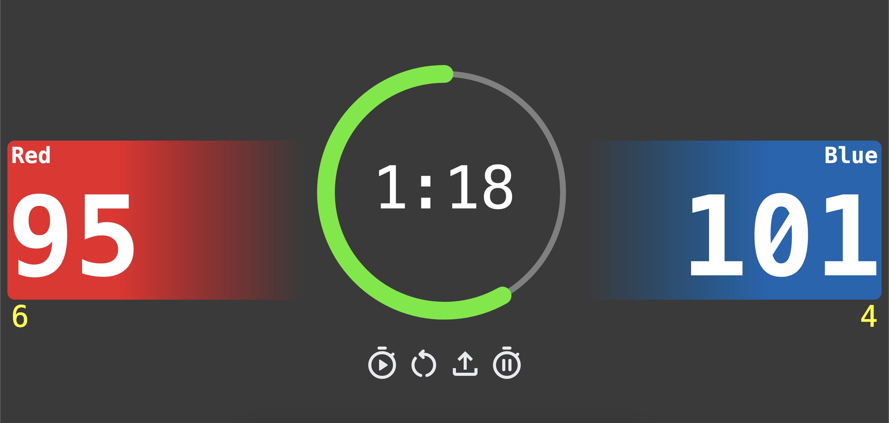
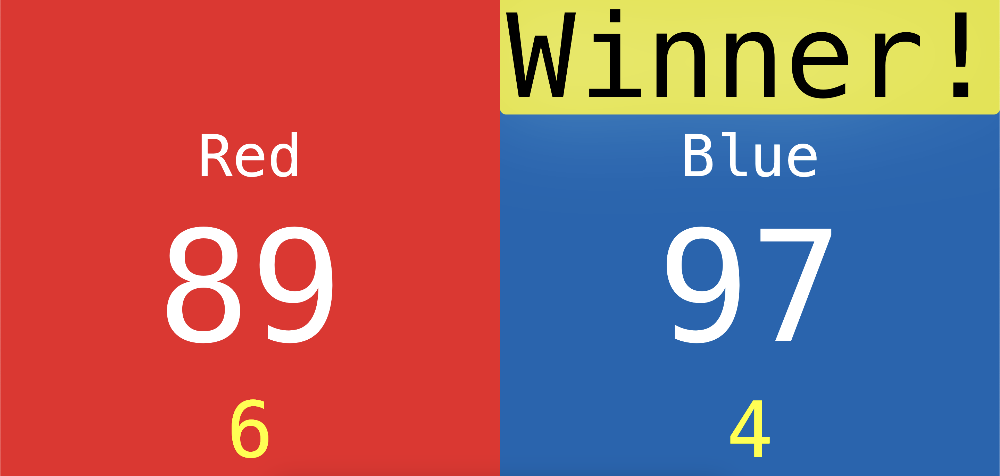

## FRC-Timer

This is a Timer designed for FRC matches (mainly for summer camp use), but can be extended for anything needing a timer and points system.

You can access the web version [here](https://netlockj.github.io/frc-timer/).

Use the buttons below the timer circle to start/stop the timer, reset the timer, and upload matches.



---

Matches must be done in JSON formatting, which [matches.json](./matches.json) (which is a [FRC double elimination bracket](https://www.chiefdelphi.com/uploads/default/original/3X/3/e/3e12925af959d0bb1ff88d7756bc47153a7198cf.png) of 8) has an example for. Use the upload button to load your match files, formatted as in the example.

You may choose whether to play a bracket like style, or just running matches by setting the 'bracket' key in your .json file to true or false. [bracket.json](./bracket.json) contains an example of how this is set up. If 'bracket' is set to true, the team names will be read from the first set of matches, and logic is carried out to find the correct team to substitute until the bracket has finished. The winner of each match will only be updated when the "final scores" are revealed after a match has concluded and the user presses the 'r' key.

```json
{
    "m1" : {
        "red": "Alliance 1",
        "blue": "Alliance 8"
    },
    ...
}
```
The names provided in each match will be the names displayed for each alliance color in the current score, and also in the final score reveal.

Resetting the timer after a match has finished (with matches data uploaded) will result in the next match being brought up. This process will continue until there are no matches left, in which case no more matches will be played.

When a match file is loaded, a new selector will appear at the top that allows one cycle through the matches by using the arrow keys.

---

Once a match has finished, (when the timer has counted down to zero), clicking the 'r' key on the keyboard will reveal the final scores and the winner. Clicking the 'r' key again will toggle the final scores off. Note that any changes to scoring will not reflect on the final scores unless they are toggled off and back on after being revealed.



---

Scoring uses the 1-8 keys on the keyboard, each pair containing an increment and decrement for points and penalties. So clicking 1 will give a point to red while clicking 2 will take the point back off.

The way that we have used the scoring feature is with [micro:bit](https://microbit.org/) controllers acting as bluetooth keyboard, and their buttons acting as the respective keys, which makes scoring with multiple much simpler. 

- 1/2 - Increment/Decrement Red Score
- 3/4 - Increment/Decrement Blue Score
- 5/6 - Increment/Decrement Red Penalties
- 7/8 - Increment/Decrement Blue Penalties
